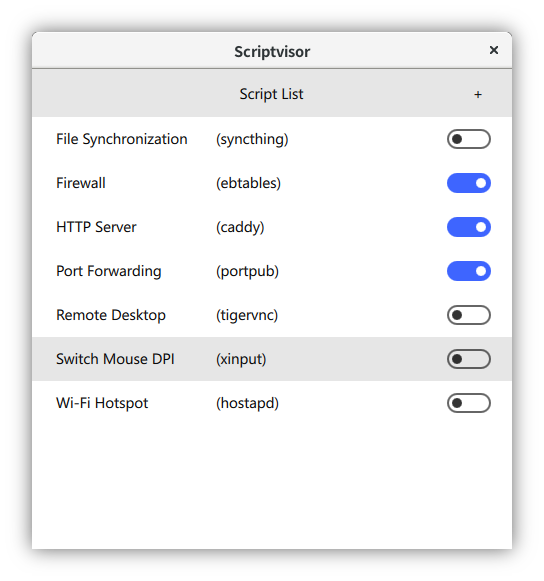

Scriptvisor
===========

Simple supervisor utility to allow you start & stop preconfigured scripts in one click

## Download

See the [releases](https://github.com/m13253/Scriptvisor/releases) page.

## Screenshots

## Building

You will need at least [Qt](https://www.qt.io/) 5.8 to build it

- To build using an IDE:

  1. Open [Qt Creator](https://www.qt.io/ide/)

  2. Open `scriptvisor.pro`

  3. Click Build → Build Project "scriptvisor"

- To build using command-line

  1. Install [qmake](http://doc.qt.io/qt-5/qmake-overview.html)

  2. Type `make`

## Scripting

On Windows, scripts are executed using PowerShell; on POSIX systems, scripts are executed using Bash.

### Startup script

If your startup script returns an exit code of non-zero, and restart delay is set to non-zero, your startup script will be executed again after the delay.

If your startup script returns an exit code of non-zero, but restart delay is set to zero, your script will be shown as "not running" in the menu.

If your startup script does not exit, or returns an exit code of zero, your script will be shown as "running" in the menu.

### Shutdown script

When your startup script is shown as "running", you can click on the switch to stop the script.

The shutdown script will be first executed, then processes started by startup script will be killed.

All shutdown scripts need to be executed before Scriptvisor exits. You may choose "Force Quit" in the tray icon menu if it takes too long.

### PowerShell execution policy problem

By default, PowerShell require scripts to be digitally signed. You have to set execution policy to `RemoteSigned` or `Unrestricted` to use Scriptvisor.

1. Open PowerShell as Administrator (Right click and select "Run as Administrator")

2. Type `Set-ExecutionPolicy RemoteSigned`

## Auto starting

### Windows

Place a shortcut to `scriptvisor.exe -autostart` at `%AppData%\Microsoft\Windows\Start Menu\Programs\Startup`.

Set the "Start in" property of the shortcut to a folder you want to place the configuration and log files.

### Linux

Type `sudo make install` to install XDG autostart configuration.

The configuration and log files will be placed at `~/.config/scriptvisor`.

## License

Scriptvisor is licensed under BSD-3-Clause, see [LICENSE](LICENSE) for more details.

You may embed Scriptvisor into your toolbox and release it as you like. But remember to leave a link to this original project, so users can update Scriptvisor when new versions release.
